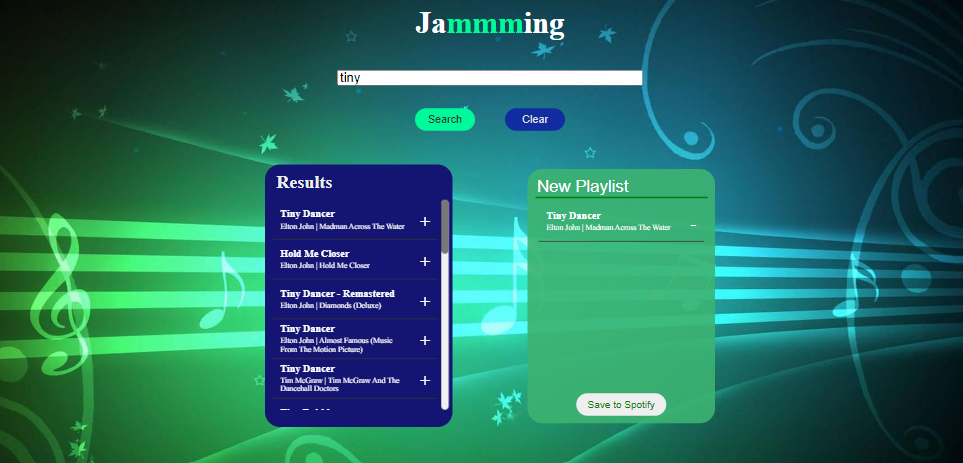

# Jammmming

A React Project that uses the Spotify API to search for songs, customize playlists, and save the directly
into their Spotify Account.

## Technology Used

- React 18.2.0
- React Testing library 13.4.0
- Jest 5.17.0
- [Spotify Web API](https://developer.spotify.com/documentation/web-api)

## Features

- Search for songs via the Search Bar
- Generate a list of songs based on the content in the Search Bar
- Add songs to a playlist
- Removes songs from a playlist
- Prevents adding the same song twice to a playlist
- Rename a playlist
- Save the playlist into your Spotify Account
- Responsive Layout ( can be viewed on 4k monitors, regular montiors, tablets, and cell phones);

## Screenshots

## Demo

Live demo [here](https://jammming-jeffhenrichs.netlify.app/)

## Lessons Learned

- Retieve data from a server using fetch API
- Make a call to an API using useEffect
- Resolve Promises using async and await keywords
- Pass functions and variables with props
- Make a request to a server and format the response
- Display and position elements with CSS
- How to look for information in the Spotify API Docs

## Project Status

The project is complete but would like to add:

- Unit Testing (In Progress)

## Acknowledgements

This project is part of the [Codecademy](www.codecademy.com) Full-Stack and Front-End Engineer Paths.
